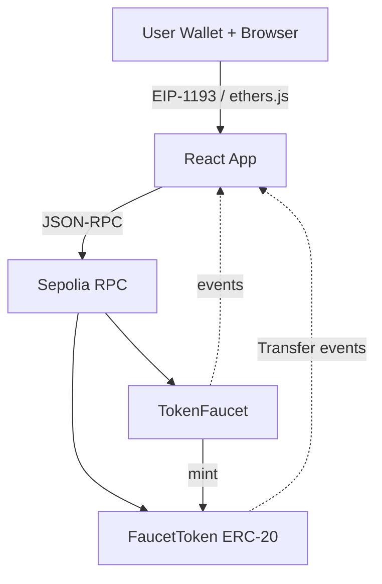

# ERC-20 Faucet DApp

End-to-end Web3 faucet demonstrating ERC-20 token minting, cooldown + lifetime limits, pause control, wallet integration (EIP-1193), and Dockerized frontend with health check and evaluation interface.

## Architecture
- Contracts: `FaucetToken` (ERC-20, owner-configured faucet minter, max supply) and `TokenFaucet` (24h cooldown, lifetime cap, pause, events, public mappings).
- Frontend: React + Vite + ethers; evaluation API exposed on `window.__EVAL__`.
- DevOps: Dockerized frontend served via Express with `/health` endpoint; env-driven RPC and addresses.



## Deployed Contracts (Sepolia)
- Token: 0xa6c1fd190ba79969bf55A8f95CAe1c97e64C57FF — https://sepolia.etherscan.io/address/0xa6c1fd190ba79969bf55A8f95CAe1c97e64C57FF
- Faucet: 0x160326f5606264C1F458FB581ab9A744E657bA20 — https://sepolia.etherscan.io/address/0x160326f5606264C1F458FB581ab9A744E657bA20

## Screenshots (placeholders; replace with real captures)
- Wallet connect: [screenshots/wallet-connection.svg](screenshots/wallet-connection.svg)
- Balance display: [screenshots/balance-display.svg](screenshots/balance-display.svg)
- Successful claim: [screenshots/successful-claim.svg](screenshots/successful-claim.svg)
- Error states (cooldown/limit/paused): [screenshots/error-states.svg](screenshots/error-states.svg)
- Tx confirmation flow: [screenshots/tx-confirmation.svg](screenshots/tx-confirmation.svg)

## Video Demo
- _Add 2–5 min link (YouTube/Loom) showing connect, initial status, success claim, cooldown revert, balance update._

## Quick Start (local)
```bash
cd submission
cp .env.example .env
# Fill SEPOLIA_RPC_URL, PRIVATE_KEY, ETHERSCAN_API_KEY, VITE_RPC_URL
npm install
npx hardhat compile
npx hardhat test
npx hardhat run --network sepolia scripts/deploy.js
node scripts/sync-frontend-env.js   # writes VITE_TOKEN_ADDRESS / VITE_FAUCET_ADDRESS

# Docker (requires Docker Desktop running)
docker compose build --no-cache
docker compose up -d
# Health check
Invoke-WebRequest -Uri http://localhost:3000/health -UseBasicParsing | Select-Object -ExpandProperty StatusCode
```

## Git Hygiene
- `.gitignore` now excludes generated artifacts (`artifacts/`, `cache/`, build-info, `frontend/dist/`), dependencies (`node_modules/`), editor cruft, logs, and all `.env` files while keeping `.env.example` tracked.
- If you already added generated files, run `git status` and remove them from the index before committing.
- Keep secrets in `.env`; never commit `.env` files. Copy from `.env.example` when needed.

## Evaluation API (run in browser console at http://localhost:3000)
```javascript
await window.__EVAL__.connectWallet();
await window.__EVAL__.getContractAddresses();
await window.__EVAL__.getBalance("0xYourAddress");
await window.__EVAL__.canClaim("0xYourAddress");
await window.__EVAL__.getRemainingAllowance("0xYourAddress");
await window.__EVAL__.requestTokens(); // returns tx hash after confirmation
```

## Environment Variables (.env)
- `SEPOLIA_RPC_URL` – Sepolia RPC endpoint
- `PRIVATE_KEY` – deployer private key
- `ETHERSCAN_API_KEY` – for verification
- `VITE_RPC_URL` – RPC URL used by frontend/ethers
- `VITE_TOKEN_ADDRESS` – deployed FaucetToken address
- `VITE_FAUCET_ADDRESS` – deployed TokenFaucet address
- `PORT` – frontend server port (default 3000)

## Contracts
- [contracts/Token.sol](contracts/Token.sol): ERC-20 with max supply, owner-only one-time `setFaucet`, mint restricted to faucet, emits Transfer.
- [contracts/TokenFaucet.sol](contracts/TokenFaucet.sol): constants FAUCET_AMOUNT, COOLDOWN_TIME (24h), MAX_CLAIM_AMOUNT; tracks `lastClaimAt` and `totalClaimed` publicly; pause control; events `TokensClaimed` / `FaucetPaused`; clear revert reasons.
- Required views: `canClaim`, `remainingAllowance`, `isPaused`, public mappings.

## Tests
- [test/TockenFaucet.test.js](test/TockenFaucet.test.js): deploy flow, success claim, cooldown enforcement, lifetime cap, pause, admin-only checks, multi-user, `remainingAllowance` correctness. Timestamp assertion is tolerant of 1s mining drift using `anyValue`.
- Run: `npx hardhat test`.

## Frontend
- React app in [frontend/src](frontend/src) with wallet connect, balances, remaining allowance, paused state, cooldown countdown, claim button with loading and errors.
- Evaluation API in [frontend/src/utils/eval.js](frontend/src/utils/eval.js):
	- `connectWallet()`: returns address string
	- `requestTokens()`: returns tx hash string
	- `getBalance(address)`: returns balance string (base units)
	- `canClaim(address)`: returns boolean
	- `getRemainingAllowance(address)`: returns string
	- `getContractAddresses()`: returns `{ token, faucet }`
- Contract helpers in [frontend/src/utils/contracts.js](frontend/src/utils/contracts.js) with env-driven addresses and RPC, cooldown constant, paused + lastClaim helpers.
- Health endpoint via Express server [frontend/server.js](frontend/server.js).

## Docker
- Build context at repo root with [docker-compose.yml](docker-compose.yml) and frontend [frontend/Dockerfile](frontend/Dockerfile).
- Healthcheck uses `/health` (curl installed in image).

## Design Decisions
- One-time faucet setter to avoid circular deployment while keeping strict mint control.
- Checks-effects-interactions in `requestTokens` before mint call.
- Clear revert messages for paused, cooldown, lifetime cap, and max supply.
- Frontend keeps numbers as strings for evaluation accuracy; displays cooldown client-side.

## Security Considerations
- Solidity 0.8 overflow checks; no reentrancy (token mint only); admin-only pause; faucet-only mint enforced in token with max supply.
- Public mappings for transparency of cooldown and totals.

## Known Gaps / TODO for submission
- Replace placeholder screenshots with real captures.
- Add video demo link.
- Update README with actual deployed Sepolia addresses + Etherscan verification links.
- Optional: add on-chain event listeners to auto-refresh without polling.

## Troubleshooting
- Stale UI (“Practice” page): If the browser shows an unrelated page, it’s usually cached content or a service worker from a different app on the same origin.
	- Open an incognito/private window and visit http://localhost:3000.
	- In DevTools → Application → Service Workers: Unregister any worker for `localhost:3000`.
	- In DevTools → Application → Clear Storage: select all and “Clear site data”. Then hard-reload with cache disabled.
	- Confirm View Source shows the bundle referenced as `/assets/index-*.js` (e.g., `index-BnPak1t_.js`).
	- Ensure only the `submission-frontend-1` container is bound to port 3000 (`docker ps`). If needed, `docker compose down && docker compose up -d --build`.
- Frontend cannot connect wallet: Make sure a Web3 wallet (e.g., MetaMask) is installed and on Sepolia. If using a remote RPC for frontend (`VITE_RPC_URL`), verify it’s reachable.
- Hardhat deploy errors: Check `.env` secrets and that `SEPOLIA_RPC_URL` is valid; verify account has Sepolia ETH; re-run `npx hardhat compile`.

